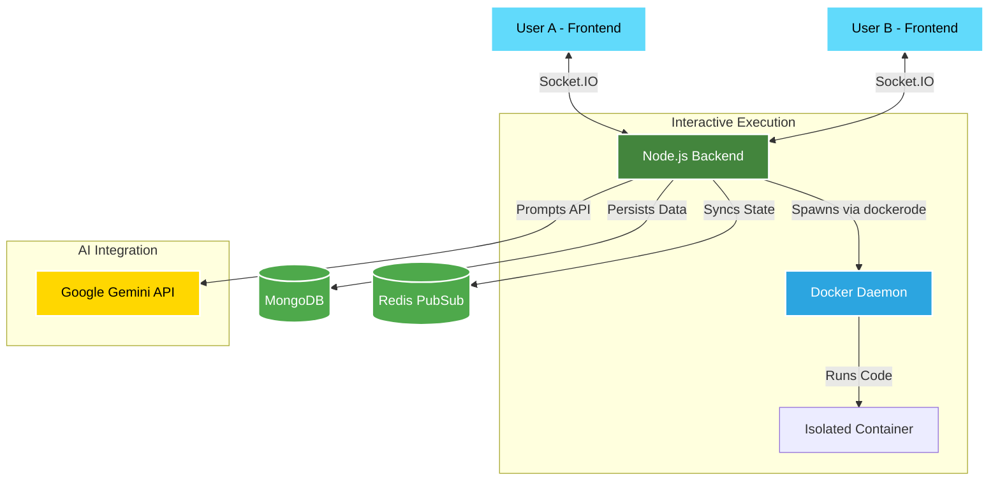

<div align="center">
  
# 🚀 ChitChat-with-AI

**A real-time, collaborative pair-programming and mentorship platform.**

[](#)
[](#)
[](#)
[](#)
[](#)

</div>

<br />

ChitChat-with-AI transforms remote coding by simulating a professional pair-programming environment. Multiple developers can join a shared workspace to write, execute, and discuss code in real-time. 

What makes it truly special is the built-in **AI Programming Mentor** (powered by Google Gemini). The AI acts as an active participant in your room, guiding users, explaining complex data structures, and providing step-by-step assistance directly within the chat interface.

---

## ✨ Key Features

- ⚡ **Real-Time Collaboration**  
  Instant messaging and synchronized room states powered by **Socket.IO** and **Redis**. Never miss a beat when collaborating with your peers.

- 🐳 **Interactive Code Execution**  
  Securely compile and run your code (C++, Python, Java, JS, etc.) on the backend using isolated **Docker containers**. Interactive standard input/output is streamed in real-time to a sleek web-based terminal.

- 🤖 **AI Programming Mentor**  
  Integrated with the latest Google Gemini AI. Just tag `@ai` in the chat, and the AI will act as a dedicated tutor. It provides beautifully formatted markdown, line-by-line code explanations, and time/space complexity analysis.

- 🔐 **Role-Based Access Control**  
  Strict room ownership protocols. Room creators have exclusive rights to manage coding sessions, invite new collaborators, or kick disruptive members.

- 💻 **Robust Editor Experience**  
  Powered by the industry-standard **Monaco Editor** (the engine behind VS Code). Enjoy rich syntax highlighting, auto-formatting, and a highly customizable dark theme.

---

## 🏗️ High-Level Architecture & Workflow

The platform leverages a modern microservice-inspired architecture, heavily utilizing WebSockets to ensure low latency.



### Core Workflows

**1. The Chat & AI Mentorship Flow**  
Every time a message is sent, it routes through the Socket.IO server. If the system detects the `@ai` tag, the backend isolates the prompt and routes it to the `AIService`. The AI's response is safely parsed, cached in Redis, and broadcasted back to all clients in the room as a visually rich markdown chat bubble.

**2. Interactive Code Execution Flow**  
When the room owner starts a coding session, the `ExecutionService` prepares a temporary sandbox on the host machine. A dedicated Docker container for the chosen language is spawned. The user's frontend terminal (powered by `xterm.js`) streams keystrokes directly to the container's standard input, and the container pushes its output back to the terminal in real-time.

---

## 📂 Project Structure

```text
ChitChat-with-AI/
├── frontend/                 # React + Vite Application
│   ├── src/
│   │   ├── components/       # Reusable React components
│   │   ├── config/           # Socket.IO & Axios configurations
│   │   ├── Pages/            # Core views (Room, Dashboard, Auth)
│   │   └── index.css         # Global styles (Tailwind + Markdown CSS)
│   └── package.json
│
└── backend/                  # Node.js + Express Backend
    ├── Controllers/          # REST API route handlers
    ├── Middleware/           # JWT Authentication & Validation
    ├── models/               # MongoDB Mongoose schemas
    ├── Services/             
    │   ├── AIService.js      # AI business logic & prompt sanitization
    │   ├── GeminiProvider.js # Google GenAI SDK implementation
    │   ├── RoomService.js    # Core room management logic
    │   ├── RedisService.js   # Ephemeral caching for speed
    │   └── Execution/        # Code execution & Docker container lifecycle
    ├── server.js             # Entry point & Socket.IO event listeners
    └── package.json
```

---

## 🛠️ Technology Stack

| Category | Technology |
| :--- | :--- |
| **Frontend UI** | React (Vite), TailwindCSS, `react-markdown` |
| **Editor & Terminal** | Monaco Editor, `xterm.js` |
| **Backend Server** | Node.js, Express.js |
| **Real-Time Engine** | Socket.IO |
| **Databases** | MongoDB Atlas (Persistent), Redis (State) |
| **Execution Engine** | Docker Engine, `dockerode` |
| **Artificial Intelligence** | Google GenAI SDK (`gemini-2.5-flash`) |

---

## 🚀 Development Roadmap

- ✅ **Phase 1**: Core chat infrastructure, MongoDB schemas, basic room management, and stateless code execution.
- ✅ **Phase 2**: Full AI integration, interactive streaming terminal execution, role-based ownership controls, and beautiful Markdown rendering.

