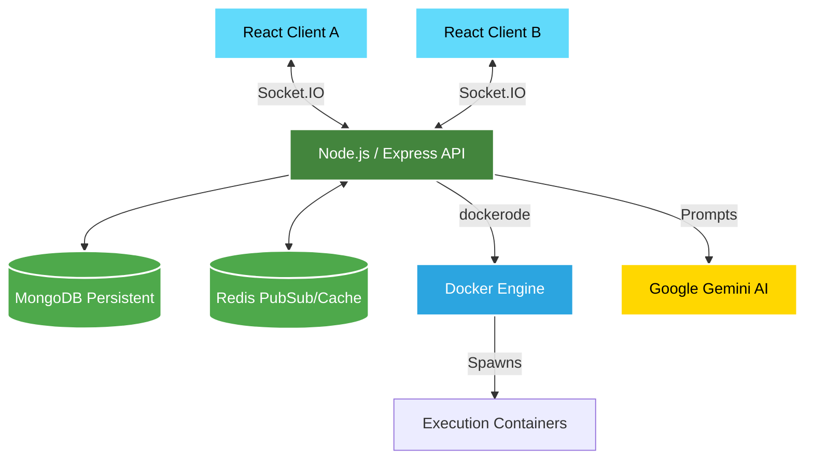
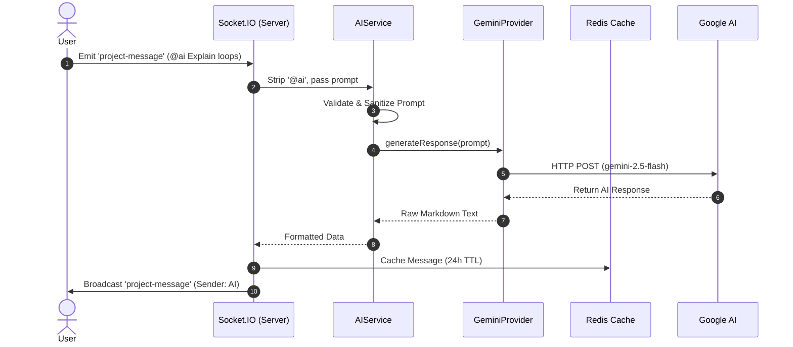
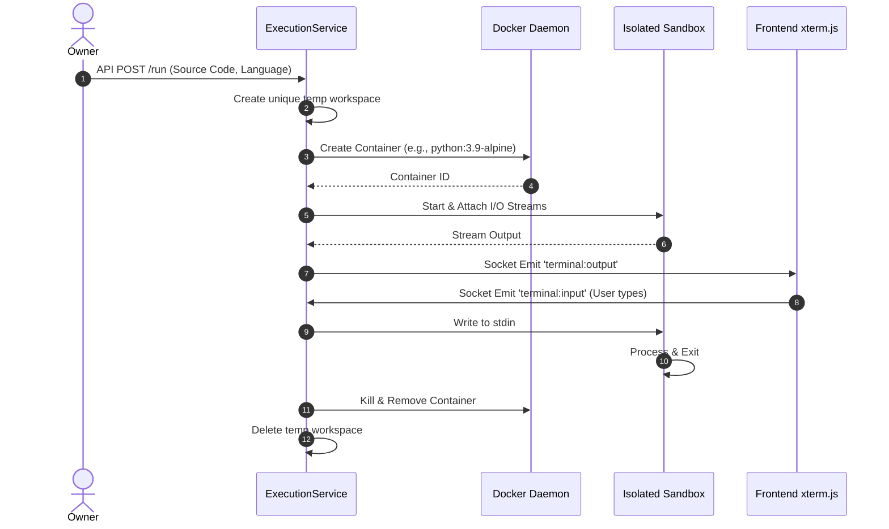

<!-- Hero Section -->
<div align="center">

  <h1>🚀 CodeCrew </h1>
  
  <p><b>A Real-Time, Collaborative coding and chatting Platform</b></p>

  <!-- Badges -->
  <p>
    
    
    
    
    
    
    
    
  </p>
  
</div>

<br />

> **CodeCrew** transforms remote development by simulating an in-person pair-programming environment. Multiple developers can join a shared workspace to write, execute, and discuss code in real-time. It features an integrated **AI Programming Mentor** powered by Google Gemini, acting as an active participant to guide, explain, and assist directly within your collaborative chat.

---

## ✨ Key Features

<table>
  <tr>
    <td width="50%">
      <h3>⚡ Real-Time Collaboration</h3>
      <p>Instant messaging and synchronized room states powered by <b>Socket.IO</b> and <b>Redis</b>. Never miss a beat when collaborating with your peers. Zero-latency updates across all connected clients.</p>
    </td>
    <td width="50%">
      <h3>🐳 Interactive Code Execution</h3>
      <p>Securely compile and run code (C++, Python, Java, JS, etc.) on the backend using isolated <b>Docker containers</b>. Interactive standard input/output is streamed in real-time to a sleek web-based terminal.</p>
    </td>
  </tr>
  <tr>
    <td width="50%">
      <h3>🤖 AI Programming Mentor</h3>
      <p>Integrated with Google Gemini AI. Tag <code>@ai</code> in the chat, and the AI will act as a dedicated tutor providing beautifully formatted markdown, line-by-line explanations, and complexity analysis.</p>
    </td>
    <td width="50%">
      <h3>🔐 Role-Based Access Control</h3>
      <p>Strict room ownership protocols. Room creators have exclusive rights to manage coding sessions, invite new collaborators, kick disruptive members, and control the environment.</p>
    </td>
  </tr>
  <tr>
    <td width="50%">
      <h3>💻 Robust Editor Experience</h3>
      <p>Powered by the industry-standard <b>Monaco Editor</b> (VS Code engine). Enjoy rich syntax highlighting, auto-formatting, and a highly customizable dark theme.</p>
    </td>
    <td width="50%">
      <h3>🚄 High Performance</h3>
      <p>State is handled purely in RAM via <b>Redis</b>. Execution environments are instantly provisioned via optimized Docker images.</p>
    </td>
  </tr>
</table>

---

## 🏗️ Architecture

The platform leverages a modern microservice-inspired architecture, heavily utilizing WebSockets to ensure low latency.



---

## 🔄 Sequence Diagrams

### 1. AI Mentorship Workflow


### 2. Interactive Docker Execution Workflow


---

## 📂 Folder Architecture

A clean separation of concerns ensures maximum maintainability.

```text
ChitChat-with-AI/
├── frontend/                     # React Single Page Application (Vite)
│   ├── src/
│   │   ├── components/           # Dumb UI components (Buttons, Modals)
│   │   ├── config/               # External tool configs (Axios, Socket)
│   │   ├── context/              # Global state (User, Auth)
│   │   ├── Pages/                # Smart components (Views)
│   │   │   └── Room.jsx          # Massive monolith logic (Execution, Chat, AI)
│   │   └── index.css             # Tailwind Directives & Markdown CSS Overrides
│   └── package.json
│
└── backend/                      # Node.js API Server
    ├── Controllers/              # Request handling & HTTP Responses
    ├── Middleware/               # Auth guards & Request validation
    ├── models/                   # Mongoose DB Schemas
    ├── Services/                 # Business Logic
    │   ├── Execution/            # Container Lifecycle Management
    │   │   ├── LanguageManager.js# Docker Image Maps & Compile Cmds
    │   │   └── TerminalManager.js# Stream routing
    │   ├── AIService.js          # AI Validation Layer
    │   ├── GeminiProvider.js     # External API integration
    │   └── RoomService.js        # Core Room state mutation
    ├── server.js                 # WebSocket entry point
    └── .env                      # Secrets (Not committed)
```

---

## 🧠 Design Decisions

- **Why Redis for Chat?** Writing chat messages to MongoDB on every keystroke introduces severe latency and disk I/O bottlenecks. Redis PubSub and Lists allow us to maintain a lightning-fast ephemeral chat history that syncs instantly across all connected clients.
- **Why Dockerode?** Executing user-provided code on the host server is a massive security vulnerability. Using Dockerode allows us to instantly spin up lightweight alpine containers, execute the code inside an isolated namespace with restricted privileges, and immediately destroy the container upon exit.
- **Provider Pattern for AI:** The `GeminiProvider` class isolates the Google SDK. If we want to switch to OpenAI or Anthropic in the future, the `AIService` and `server.js` require zero changes.

---

## 🔒 Security

- **Container Isolation**: User code is executed in unprivileged Docker containers with limited memory and CPU quotas.
- **Ephemeral Workspaces**: Source code files are written to `/tmp` and immediately wiped after execution.
- **Environment Variables**: Sensitive keys (MongoDB URIs, Gemini API Keys, JWT Secrets) are strictly isolated in `.env` and never exposed to the client bundle.
- **JWT Authentication**: All API routes and WebSocket handshakes are secured via signed JSON Web Tokens.

---

## 🚀 Deployment Instructions

### Prerequisites
- Node.js (v18+)
- Docker Engine (Running locally)
- MongoDB Atlas Cluster
- Redis Server (Local or Cloud)
- Google Gemini API Key

### Backend Setup
```bash
cd backend
npm install
cp .env.example .env # Add your keys here
npm run dev
```
*Note: Ensure your user is in the `docker` group to prevent `docker.sock` permission errors.*

### Frontend Setup
```bash
cd frontend
npm install
npm run dev
```

---

## 📈 Performance Highlights

- **Sub-Second Code Execution**: By utilizing pre-pulled Alpine Linux images, container instantiation and code compilation take less than 1.5 seconds on average.
- **Zero-Layout-Shift Markdown**: AI responses are streamed and parsed efficiently via `react-markdown` without causing jarring UI jumps.
- **WebSocket Reconnection**: Graceful reconnection logic ensures users don't lose chat history if their network drops temporarily.

---

## 🗺️ Future Roadmap

- [x] Leetcode style environment for competitive programming

---
